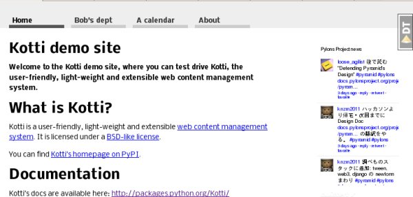

Kotti Demo
^^^^^^^^^^

.. toc::

The source for `Kotti's demo site`_ is included in Kotti's source distribution.
This chapter explains how to install and run the demo.  You'll need Python_ 2.7
or 2.6 installed, along with virtualenv_, Git_, and SQLite_. 

Written using Python 2.7.2, Ubuntu 8.04 (yes it's old), Kotti 1.4-dev (rev.
8c5f84902d80d517245c4ace679cac57b89e510d, 2011-11-08), Pyramid 1.3-dev (rev.
2da8c01bb965188f497c9f3a5dde1287b8c7056b, 2011-11-07).  

Installation
============

1. Create a virtualenv. We'll call it "venv".

   ..code-block:: bash

        virtualenv --no-site-packages venv

   The "--no-site-packages" flag prevents globally-installed Python packages
   from being visible in the virtualenv. This may avoid version conflicts
   between Kotti's dependencies and other packages installed on the system.
   It's necessary on Ubuntu because 'zope' is a namespace package installed by
   default on Ubuntu systems, and it does not contain certain subpackages used
   by pyramid. Namespace packages can't span installation directories.

2. Activate the virtualenv. 

   .. code-block:: bash

        source venv/bin/activate

3. Check out Kotti's source repository and other repositories.

   .. code-block:: bash

        git checkout git://github.com/Pylons/pyramid
        git checkout git://github.com/dnouri/Kotti
        git checkout git://github.com/dnouri/kotti_calendar
        git checkout git://github.com/dnouri/kotti_twitter

   We're using the development versions of Pyramid and Kotti because they're
   changing rapidly. We're checking out kotti_calendar and kotti_twitter
   because they're not yet available on PyPI. We aren't yet using
   kotti_rstdocument so you can skip it for now, but a future version of the
   demo will probably use it.

4. Install the packages in the same order. (This order avoids forward
   dependencies on subsequent repositories.)

   .. code-block:: bash

        pip install -e pyramid
        pip install -e Kotti
        pip install -e kotti_calendar
        pip install -e kotti_twitter

5. Make a local copy of the demo directory and chdir into it.

   .. code-block:: bash

        cp -r Kotti/demo demo
        cd demo

   This directory contains the initial demo database (demo.sqlite) and INI file
   (development.ini). By copying it, you can restore the defaults easily by
   overwriting the runtime files, without changing the files in the checkout.

6. Run the demo:

   .. code-block:: bash

        pserve development.ini

  (If running on Pyramid 1.2, use the older syntax: "paster serve
  development.ini".)

Open your web browser to the URL indicated (http://127.0.0,1:5000/). You should
see the following screen with "Kotti's demo site" at the top. 

Play around with the site, and when you get bored press ctrl-C to stop the
server. The console will log database queries as they are executed.

Troubleshooting:

* If the home page is a blank screen with "My Site" at the top, you're not
  using the demo database.  Kotti automatically creates a default site if the
  database file is not found. Make sure the "sqlalchemy.url" setting in the INI
  file points to the demo database file, and restart the server. The
  "%(here)s" syntax in the setting's value means the directory containing the
  INI file.

* If there's a black panel on the right side of the screen, that's Pyramid's
  debug toolbar. Click the "Hide" link at the top to shrink it to a small "DT"
  button.

* If you find the continuously-updating Twitter feed in the right sidebar
  distracting, you can disable it by putting a "#" at the beginning of the
  following line in the INI file: 
  "kotti.includes = kotti_twitter.include_search_widget", and restarting the
  server. 

The top row is the main menu. Four sections are predefined: "Home", "Bob's
dept", "Calendar", and "About". Click "Bob's dept". Open the page editor by
appending "edit" to the URL (so that it's
"http://127.0.0.1:5000/bobs-department/edit"). You'll get a login screen. Enter
username "admin", password "qwerty". (There are two other users, "owner" and
"bob", all with the same password.) The "View" button at the left allows you to
switch between view and edit mode. To log out, change the URL to
"http://localhost:5000/logout".

Kotti features shown in the demo
================================

XXX

.. _Kotti's demo site: http://kottidemo.danielnouri.org/
.. _Python:  http://python.org/
.. _virtualenv:  http://pypi.python.org/pypi/virtualenv
.. _git:  http://git-scm.com/
.. _SQLite:  http://sqlite.org/
